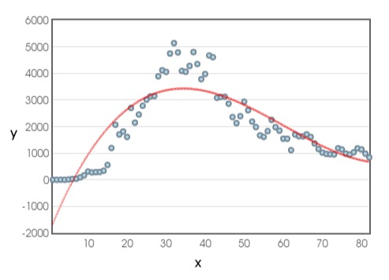
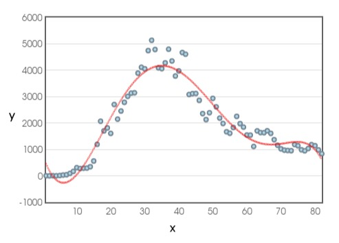
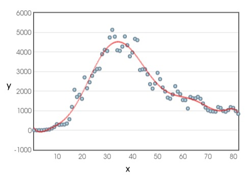

## Hakkında

* Polinom interpolasyonu yöntemi ile veriler polinoma yakınlaştırılmaya çalışılmıştır.
* Girdi olarak bulunduğu dizindeki veriler.txt dosyasını alır.

## Yapı

* Program girdiler üzerinde 1. 2. 3. 4. 5. ve 6. dereceden polinomlara yakınlaştırma işlemi yapar.
* Ancak nDerecedenPolinomaYakinlastir(m, veri) fonksiyonu ile istenilen derecede işlem yapılabilir.
* Elde edilen katsayıları sonuc.txt dosyasına yazar.
* Her polinom için elde edilen değer ile gerçek değer arasındaki hata hesaplanır.
* Her 10'lu veri grupları için tekrar işlem yaparak bütün veri kümesi için hangi 10'lu veri grubunun hangi dereceden polinoma uygun olduğunu belirtir.

## Çıktılar

Noktalar = Veriler.txt deki veriler

Kırmızı eğri = Verilerin 3. dereceden polinoma yakınlaştırılması ile oluşturulmuştur

Kırmızı eğri = Verilerin 6. dereceden polinoma yakınlaştırılması ile oluşturulmuştur

Kırmızı eğri = Verilerin 9. dereceden polinoma yakınlaştırılması ile oluşturulmuştur
